# South Korea Variable PNG Charts

- Station basis: South Korea mainland, 56 stations for 1973-1989 and 62 stations for 1990 onward.
- Sign basis: 0 means the 33.33-66.67 percentile range for each calendar month in 1991-2020.

## Mean Temperature

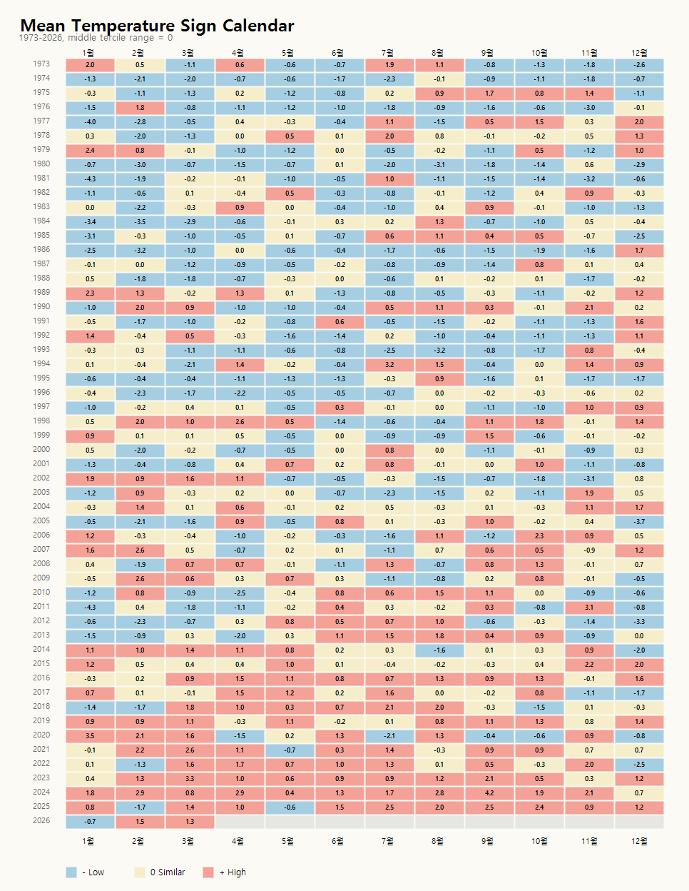

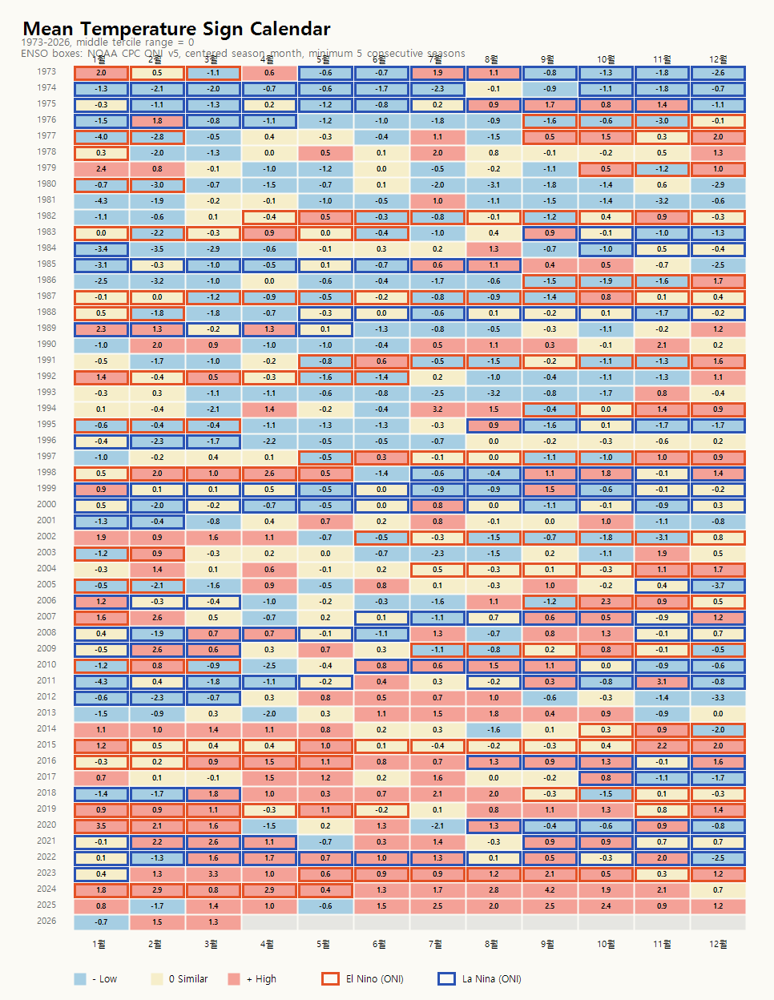

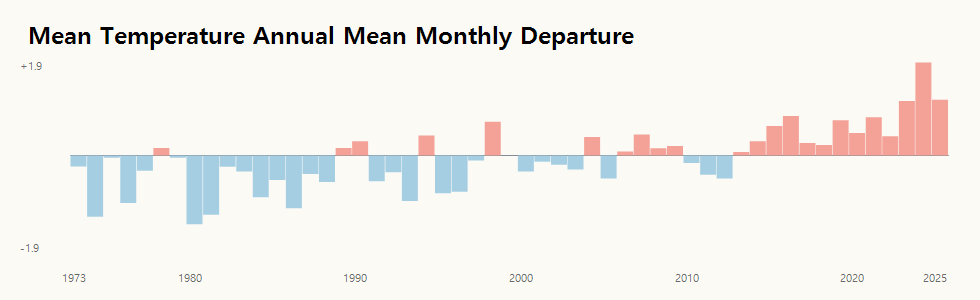

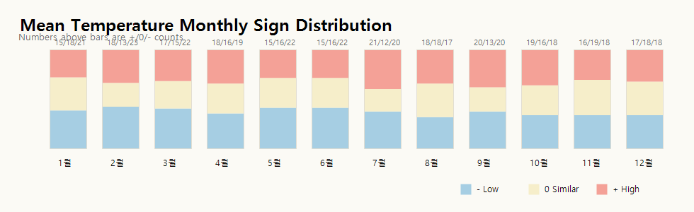

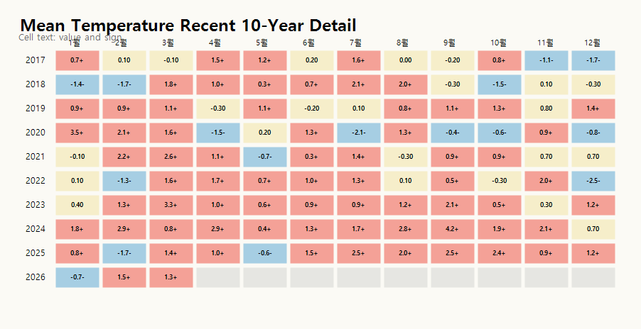

## Minimum Temperature

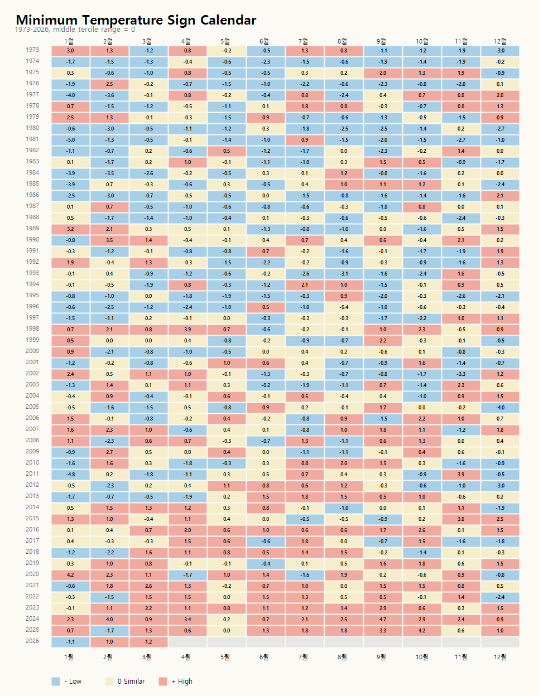

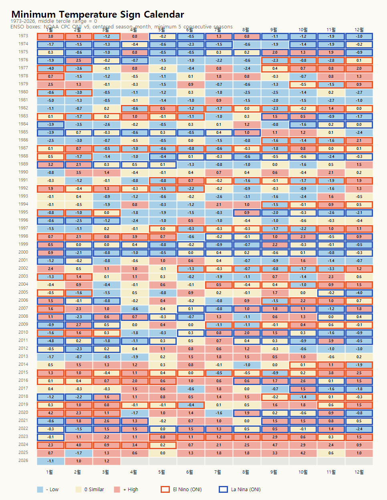

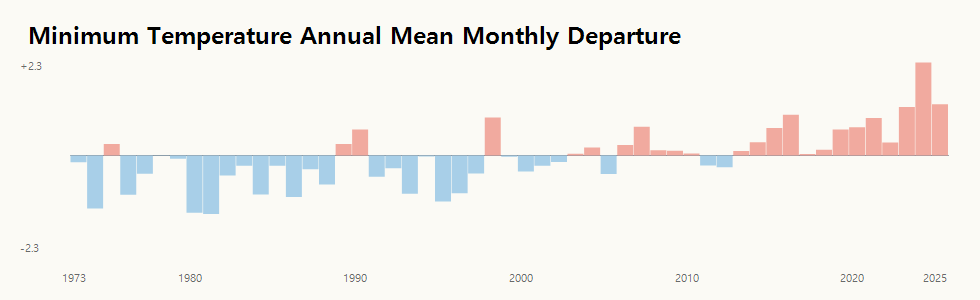

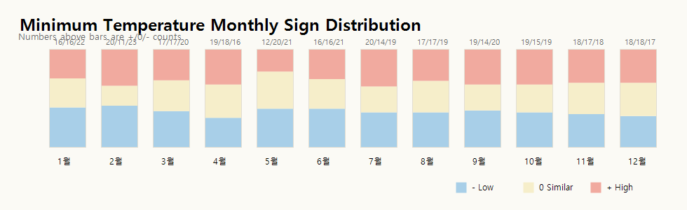

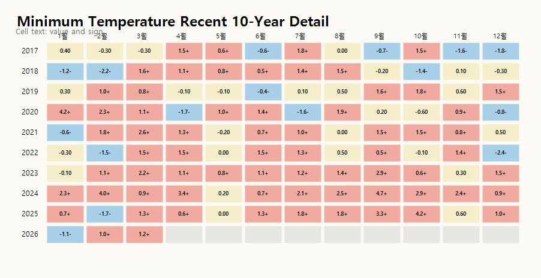

## Maximum Temperature

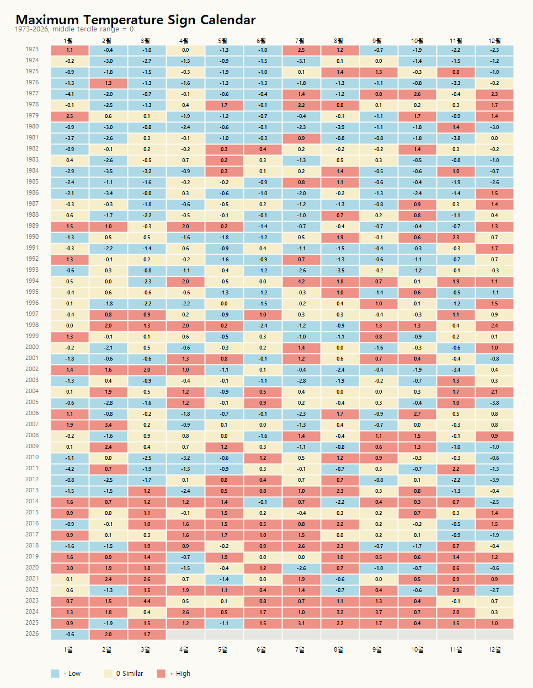

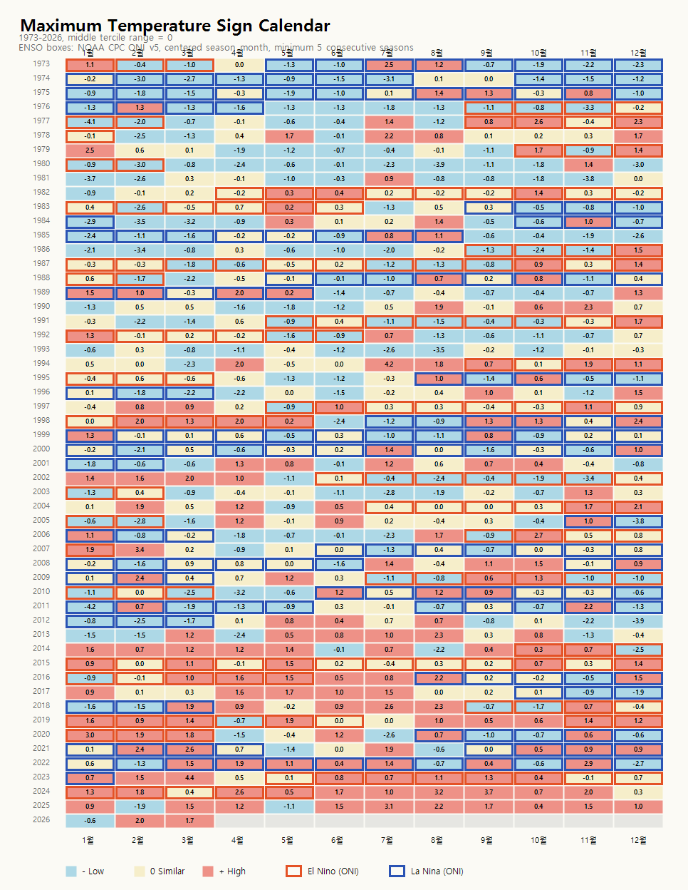

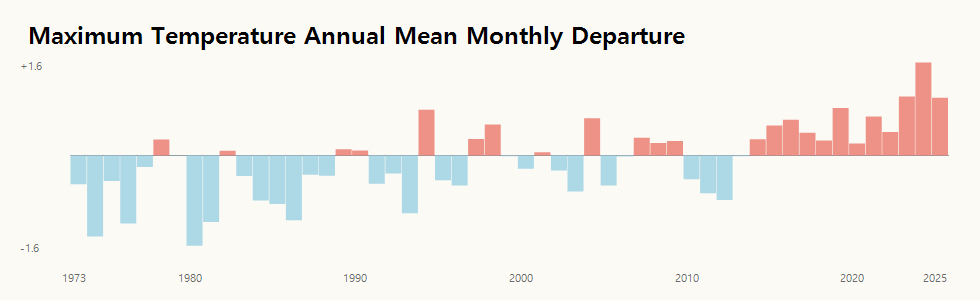

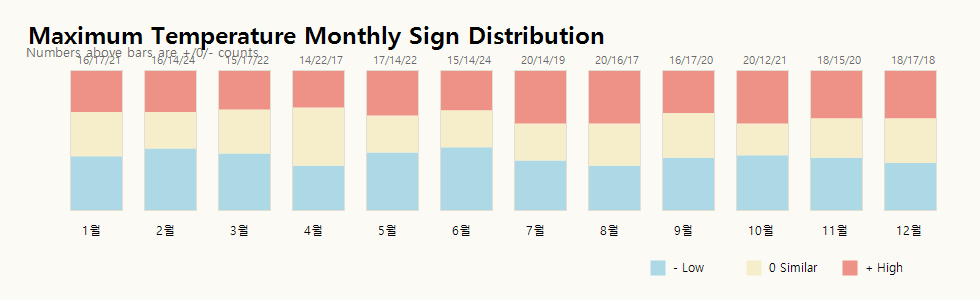

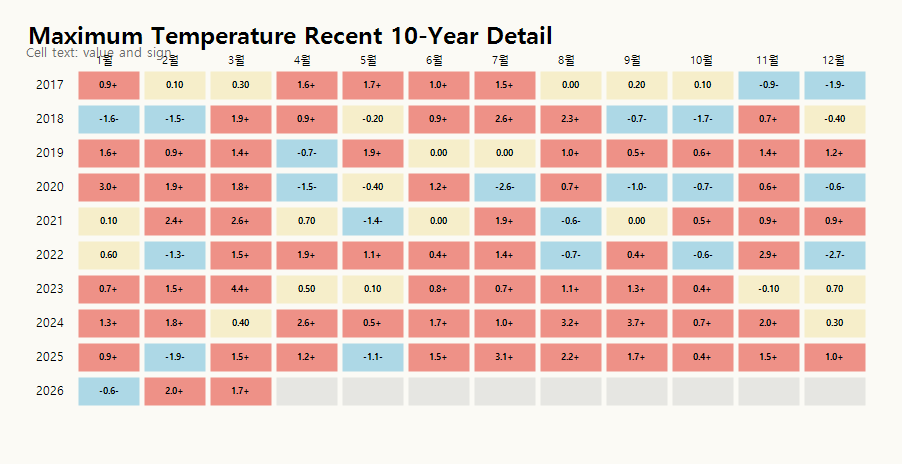

## Precipitation

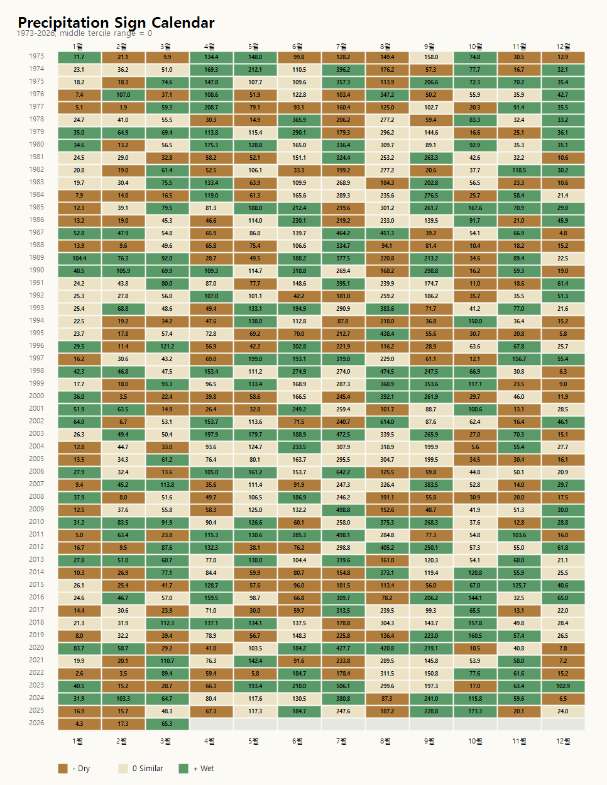

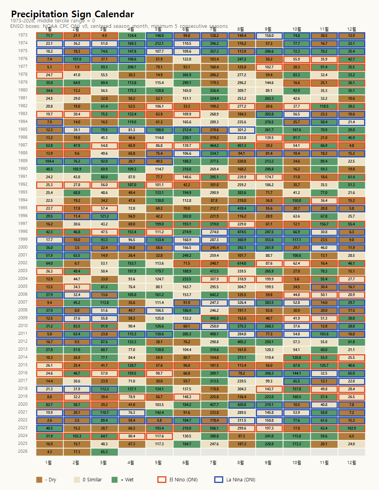

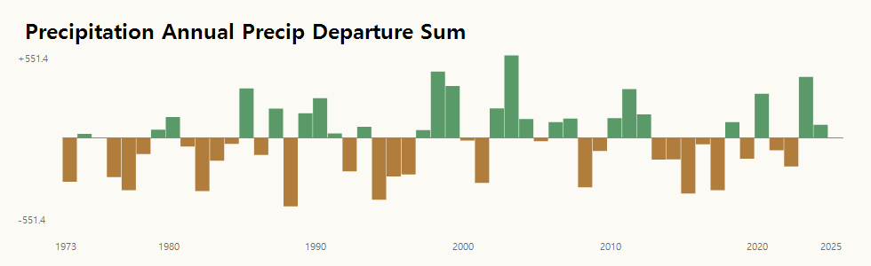

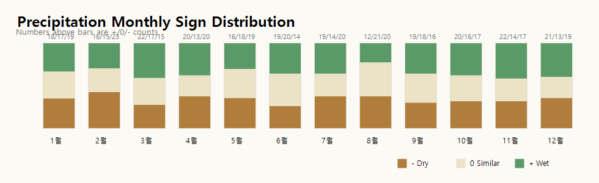

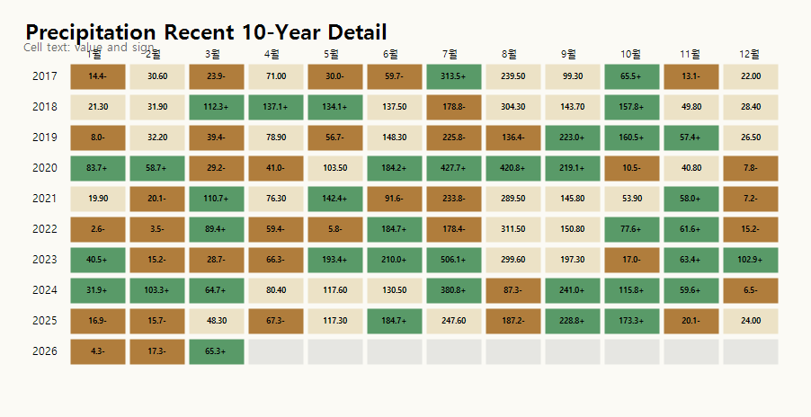

