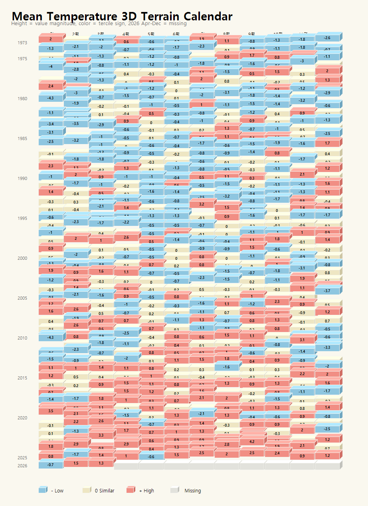
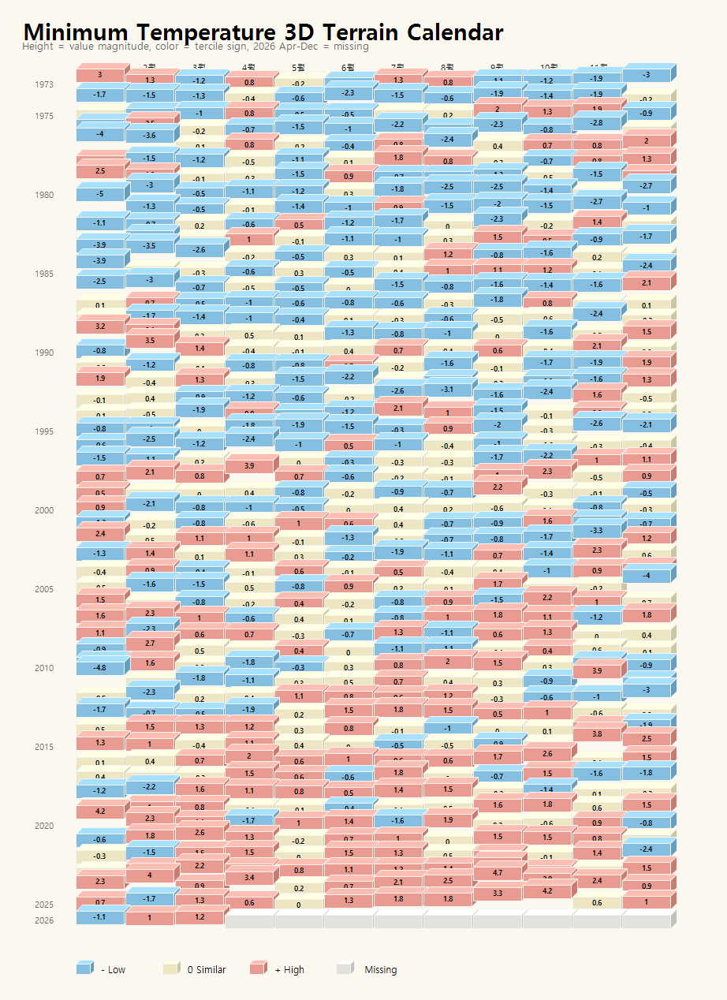
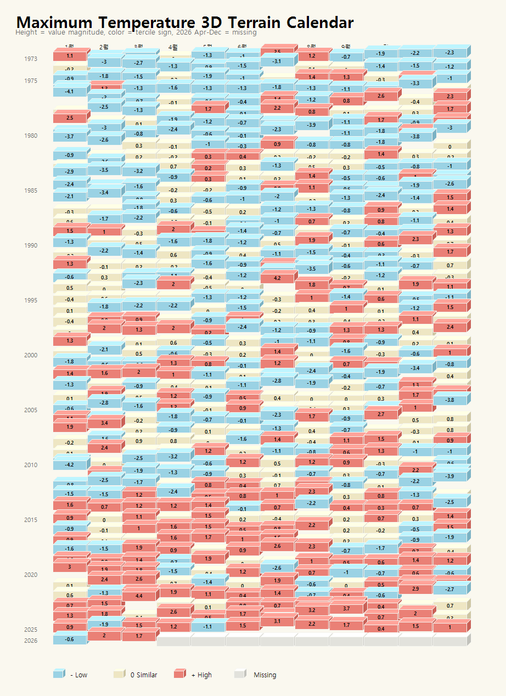
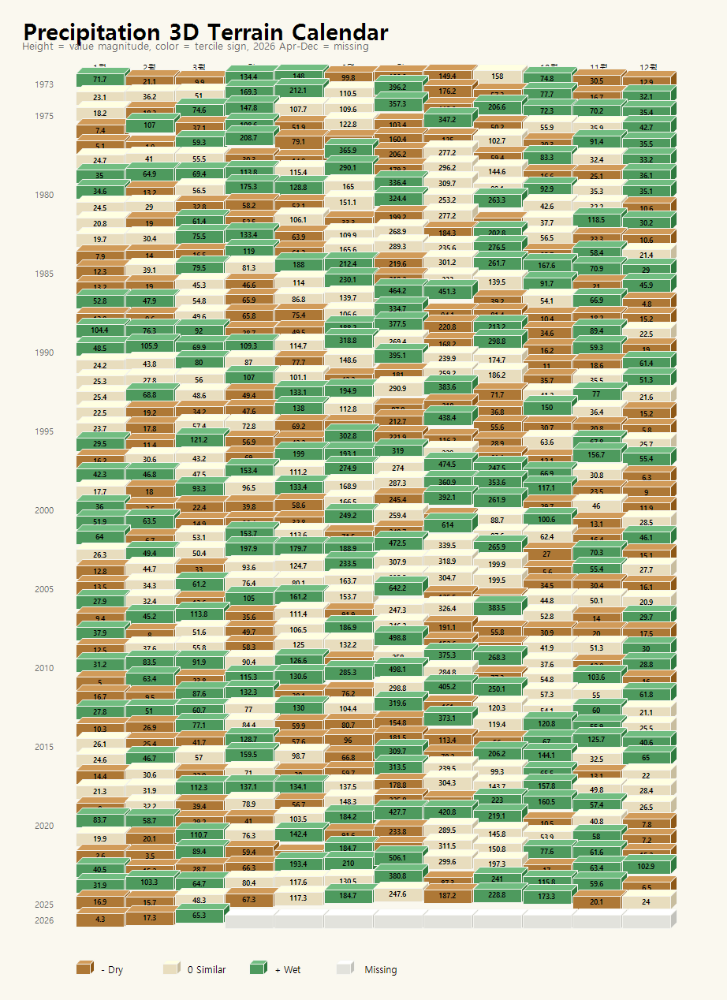

# 3D Terrain Calendars

- Height expresses magnitude; color expresses tercile sign.
- Temperature uses monthly departure magnitude.
- Precipitation uses monthly precipitation magnitude.
- 2026 Apr-Dec is rendered as missing.

## Mean Temperature

## Minimum Temperature

## Maximum Temperature

## Precipitation

